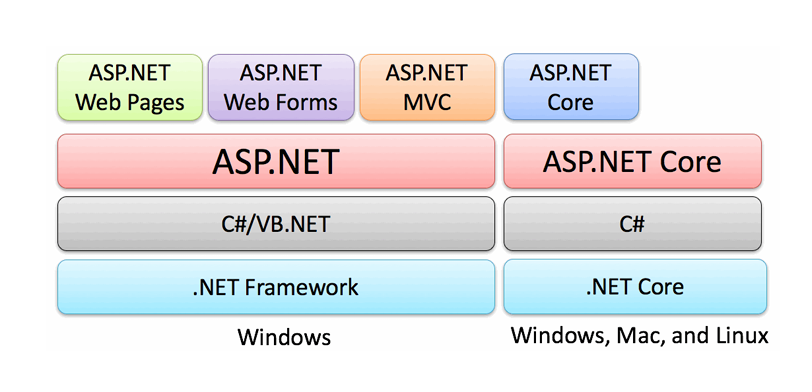

# Lecture 1: Introduction to Visual Programming and C#

---

## Course Context & Motivation

### Why This Lecture Matters

* Modern software is **interactive**, **visual**, and **event‑driven**
* C# with .NET is widely used in **industry**, **academia**, and **enterprise systems**
* Visual programming helps beginners **see** how programs work instead of only imagining logic

### Real‑World Connection

* ATM machines 🏧
* Desktop billing systems
* Hospital management software
* Educational tools with buttons, forms, and menus

---

## What is Visual Programming?

### Definition

Visual Programming is a programming approach where developers build applications using **graphical components** (buttons, text boxes, labels, forms) instead of writing only text‑based code.

### Key Idea

> *“You design the interface visually and control it using code.”*

### Examples of Visual Elements

* Buttons (Submit, Login)
* TextBoxes (Name, Password)
* Labels (Instructions)
* Forms (Windows / Screens)

---

## Visual Programming vs Traditional Programming

| Traditional Programming | Visual Programming           |
| ----------------------- | ---------------------------- |
| Console based           | GUI based                    |
| Text input/output       | Mouse & keyboard interaction |
| Linear execution        | Event‑based execution        |
| Less user‑friendly      | Highly user‑friendly         |

### Example

* **Traditional**: User types command in terminal
* **Visual**: User clicks a button to perform action

---

## Real‑World Example of Visual Programming

### Login Screen Example

* User enters username & password
* User clicks **Login** button
* System verifies credentials

### What Happens Behind the Scene?

* Button click triggers an **event**
* Code executes only when the event occurs

This leads us to the concept of **Event‑Driven Programming**.

---

## Event‑Driven Programming Concept

### What is Event‑Driven Programming?

Event‑driven programming is a paradigm where the **flow of the program is determined by user actions (events)**.

### Common Events

* Button Click
* Mouse Hover
* Key Press
* Form Load

### Important Point

> The program **waits** for an event to occur.

---

## Event‑Driven Programming – Real Life Analogy

### Door Bell Analogy 🚪🔔

* You do nothing until someone presses the doorbell
* When bell rings → you respond

### In Programming

* Program waits silently
* User clicks button → code runs

This makes applications **efficient** and **interactive**.

---

## Introduction to the .NET Ecosystem

### What is .NET?

.NET is a **software development platform** created by Microsoft for building different types of applications.

### What .NET Provides

* Programming languages (C#, F#, VB.NET)
* Runtime environment (CLR)
* Libraries for UI, database, networking, web

---

## Components of .NET Ecosystem

### Core Components

* **C# Language** – main programming language
* **CLR (Common Language Runtime)** – executes code
* **Base Class Library (BCL)** – ready‑made functions

### Tools

* Visual Studio
* .NET SDK

---

## Why C# with .NET?

### Advantages

* Easy to learn (similar to C++ / Java)
* Strongly typed and secure
* Excellent GUI support
* Industry‑level performance

### Used By

* Microsoft
* Banks
* Universities
* Software companies

---

## .NET vs .NET Core vs .NET 6+

### .NET Framework

* Windows only
* Older technology
* Used for legacy desktop apps

### .NET Core

* Cross‑platform (Windows, Linux, macOS)
* High performance
* Modern development approach

### .NET 6+

* Unified platform
* Faster and lighter
* Long‑term support (LTS)

---

## Simple Comparison Table

| Feature        | .NET Framework | .NET Core      | .NET 6+            |
| -------------- | -------------- | -------------- | ------------------ |
| Platform       | Windows only   | Cross‑platform | Cross‑platform     |
| Performance    | Moderate       | High           | Very High          |
| Future Support | Limited        | Merged         | Actively supported |

---

## Applications of C#

### Desktop Applications

* Windows Forms
* WPF Applications

### Web Applications

* ASP.NET Core
* MVC Web Apps

### APIs

* REST APIs
* Backend services for mobile apps

---

## Real‑World Applications of C#

* University Management Systems
* Inventory & Billing Software
* Banking Systems
* Hospital Information Systems
* Web APIs for Mobile Apps

---

## Why Learn C# for Visual Programming?

* Perfect for beginners
* Strong GUI support
* Event‑driven by nature
* Used in real‑world systems

> *Learning C# is not just academic — it is professional skill development.*

---

## Summary of Lecture 1

* Visual Programming focuses on GUI‑based development
* Event‑driven programming reacts to user actions
* .NET is a powerful development ecosystem
* C# is a versatile and industry‑ready language

---

## What’s Next?

* Setting up Visual Studio
* First Visual C# Application
* Understanding Forms and Controls

---

### Reference

Text Book 3

---

*End of Lecture 1*
