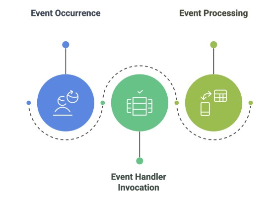

# Lecture 1: Introduction to Visual Programming and C#

---

## Course Context & Motivation

### Why This Lecture Matters

* Modern software is **interactive**, **visual**, and **event‑driven**
* C# with .NET is widely used in **industry**, **academia**, and **enterprise systems**   (integrated software application that centralizes and manages an organization's core business processes like finance, HR, sales,)
* Visual programming helps beginners **see** how programs work instead of only imagining logic

### Real‑World Connection

* ATM machines 
* Desktop billing systems
* Hospital management software
* Educational tools with buttons, forms, and menus

---

## What is Visual Programming?

### Definition

Visual Programming is a programming approach where developers build applications using **graphical components** (buttons, text boxes, labels, forms) instead of writing only text‑based code.

### Key Idea

> *“You design the interface visually and control it using code.”*

### Examples of Visual Elements

* Buttons (Submit, Login)
* TextBoxes (Name, Password)
* Labels (Instructions)
* Forms (Windows / Screens)

---

## Visual Programming vs Traditional Programming

| Traditional Programming | Visual Programming           |
| ----------------------- | ---------------------------- |
| Console based           | GUI based                    |
| Text input/output       | Mouse & keyboard interaction |
| Linear execution        | Event‑based execution        |
| Less user‑friendly      | Highly user‑friendly         |

### Example

* **Traditional**: User types command in terminal
* **Visual**: User clicks a button to perform action

---

## Real‑World Example of Visual Programming

### Login Screen Example

* User enters username & password
* User clicks **Login** button
* System verifies credentials

### What Happens Behind the Scene?

* Button click triggers an **event**
* Code executes only when the event occurs

This leads us to the concept of **Event‑Driven Programming**.

---

## Event‑Driven Programming Concept

### What is Event‑Driven Programming?

Event‑driven programming is a paradigm where the **flow of the program is determined by user actions (events)**.

### Common Events

* Button Click
* Mouse Hover
* Key Press
* Form Load

### Important Point

> The program **waits** for an event to occur.

---

## Event‑Driven Programming – Real Life Analogy

### Door Bell Analogy

* You do nothing until someone presses the doorbell
* When bell rings → you respond

### In Programming

* Program waits silently
* User clicks button → code runs

This makes applications **efficient** and **interactive**.

---

## Introduction to the .NET Ecosystem

### What is .NET?

.NET is a **software development platform** developed by Microsoft. It provides a complete environment for building and running applications such as desktop software, web applications, and APIs.

### What .NET Provides

* Programming languages (C#, F#, VB.NET)
* A runtime environment (CLR)
* Libraries for user interfaces, databases, networking, and web development

---

## Components of the .NET Ecosystem

### Core Components

* **C# Language** – the primary language used to write application logic
* **CLR (Common Language Runtime)** – the execution engine responsible for running applications
* **Base Class Library (BCL)** – a collection of pre-built classes for common tasks such as file handling, data access, and user interface development

### Development Tools

* Visual Studio
* .NET SDK

---

## .NET Runtime and Program Execution (Understanding the Diagram)

When a C# application is developed, the written code cannot be understood directly by the computer hardware. Computers operate at the machine level, whereas developers write code using human-readable programming languages. The .NET platform acts as an intermediary layer that enables smooth communication between the developer and the system.

### Role of the .NET Runtime

The .NET runtime performs several critical responsibilities:

* It reads and processes C# source code
* It translates the code into a form that the computer can execute
* It manages memory automatically during program execution
* It ensures that applications run in a safe and controlled environment

### Real-World Analogy

Consider a scenario where a person speaks English and another understands only machine language. Direct communication is not possible without assistance. In this case, the .NET runtime acts as a **translator**, enabling meaningful interaction between the developer and the computer system.

---

## Common Language Runtime (CLR)

The Common Language Runtime (CLR) is a core component of the .NET platform and is responsible for the actual execution of applications.

### Responsibilities of the CLR

* Executes application code
* Manages memory allocation and deallocation
* Handles exceptions and runtime errors
* Improves performance through optimization techniques

### Conceptual Analogy

The CLR can be compared to a **classroom instructor** who ensures that students follow rules, maintain discipline, and work efficiently. Without such supervision, the learning environment becomes unstable.

### Importance of the CLR

In the absence of the CLR:

* Applications may crash unexpectedly
* System resources may be misused
* Overall performance may degrade

---

## ASP.NET and Web Development in .NET

ASP.NET is a web development framework within the .NET ecosystem that enables developers to build **websites, web applications, and web APIs** using the C# programming language.

### Understanding ASP.NET as a Family of Technologies

ASP.NET should be viewed as a **family of related frameworks**, each designed to address different development needs. Although they all use C# and the .NET platform, their internal architectures and usage scenarios differ.

A useful analogy is that of a restaurant offering multiple styles of the same dish. The ingredients are similar, but the preparation and presentation vary.

---

### ASP.NET Web Forms

ASP.NET Web Forms represents the earliest approach to web development in the .NET ecosystem. It emphasizes rapid application development through visual controls and event handling.

**Characteristics:**

* Drag-and-drop user interface components
* Event-driven programming model similar to desktop applications
* Minimal manual handling of web requests

**Practical Interpretation:**
Web Forms simplify development by hiding many web-related details from the developer. While this makes them easy to start with, it also limits flexibility and control.

**Limitations:**

* Limited customization
* Lower performance compared to modern frameworks
* Primarily suitable for legacy systems

**Platform Support:**

* Windows only

---

### ASP.NET MVC (Model–View–Controller)

ASP.NET MVC introduces a structured design pattern that separates application responsibilities into three distinct components:

* **Model** – manages application data
* **View** – presents data to the user
* **Controller** – handles user input and application logic

**Conceptual Example:**
In a hospital system, patient records correspond to the Model, the reception interface corresponds to the View, and medical staff decision-making corresponds to the Controller.

**Advantages:**

* Clear separation of concerns
* Improved maintainability
* Widely adopted in professional environments

**Platform Support:**

* Windows only

---

### ASP.NET Core

ASP.NET Core is the modern evolution of ASP.NET and is designed to meet contemporary development requirements.

**Key Features:**

* High performance and efficiency
* Lightweight and modular architecture
* Built-in support for web APIs and cloud applications

**Platform Support:**

* Cross-platform (Windows, Linux, macOS)

Although ASP.NET Core uses the same C# language and follows similar architectural patterns, it is built on a newer runtime that significantly enhances performance and flexibility.

---

## ASP.NET MVC vs ASP.NET Core MVC

A common point of confusion among learners is the distinction between ASP.NET MVC and ASP.NET Core MVC.

* **ASP.NET MVC** operates on the traditional .NET Framework and is limited to Windows environments.
* **ASP.NET Core MVC** uses the modern .NET runtime and supports cross-platform deployment.

While both employ the MVC design pattern, their underlying execution engines differ.

---

## Cross-Platform Support Summary

| Technology        | Cross-Platform Support |
| ----------------- | ---------------------- |
| ASP.NET Web Forms | No                     |
| ASP.NET MVC       | No                     |
| ASP.NET Core      | Yes                    |

---

## Comparative Overview of ASP.NET Technologies

| Feature             | Web Forms               | MVC                          | ASP.NET Core                     |
| ------------------- | ----------------------- | ---------------------------- | -------------------------------- |
| Introduction Period | Early                   | Intermediate                 | Modern                           |
| Development Style   | Visual and event-driven | Structured and pattern-based | Modular and performance-oriented |
| Performance         | Lower                   | Moderate                     | High                             |
| Cross-Platform      | No                      | No                           | Yes                              |
| Industry Adoption   | Limited                 | Moderate                     | High                             |

---

## Recommended Learning Path

For modern software development and industry relevance, **ASP.NET Core** is the recommended framework. It supports cross-platform development, integrates seamlessly with APIs and cloud services, and aligns with current industry standards.

Legacy frameworks such as Web Forms are primarily maintained for historical systems, while traditional ASP.NET MVC represents a transitional phase toward modern architectures.

---

## Cross-Platform Support Comparison

| Technology        | Cross-Platform |
| ----------------- | -------------- |
| ASP.NET Web Forms | No             |
| ASP.NET MVC       | No             |
| ASP.NET Core      | Yes            |

---

## .NET Framework vs .NET Core vs .NET 6+

### .NET Framework

* Windows-only platform
* Used for older desktop and web applications

### .NET Core

* Cross-platform support
* Better performance and modular design

### .NET 6+

* Unified platform combining previous versions
* Improved speed and long-term support

---

## Applications of C#

### Desktop Applications

* Windows Forms
* WPF Applications

### Web Applications

* ASP.NET Core
* MVC Web Apps

### APIs

* REST APIs
* Backend services for mobile apps

---

## Real‑World Applications of C#

* University Management Systems
* Inventory & Billing Software
* Banking Systems
* Hospital Information Systems
* Web APIs for Mobile Apps

---

## Why Learn C# for Visual Programming?

* Perfect for beginners
* Strong GUI support
* Event‑driven by nature
* Used in real‑world systems

> *Learning C# is not just academic — it is professional skill development.*

---

## Summary of Lecture 1

* Visual Programming focuses on GUI‑based development
* Event‑driven programming reacts to user actions
* .NET is a powerful development ecosystem
* C# is a versatile and industry‑ready language

---

## What’s Next?

* Setting up Visual Studio
* First Visual C# Application
* Understanding Forms and Controls

---

### Reference

Text Book 3

---

*End of Lecture 1*
