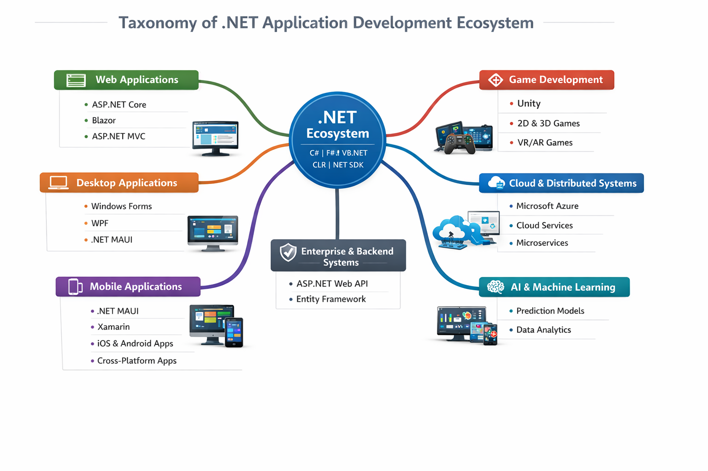
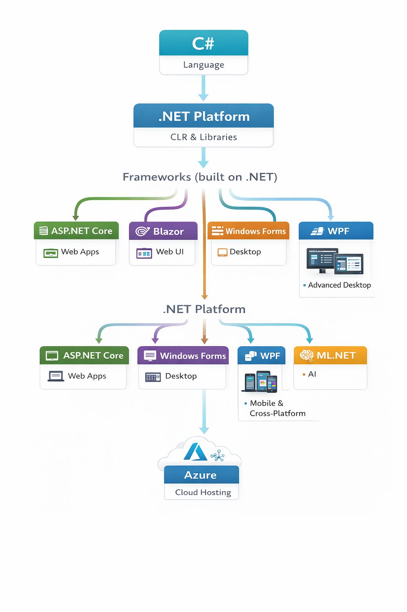

# Understanding the .NET Ecosystem
## Frameworks, Architecture & Application Domains

---

# Learning Objectives

By the end of this lecture, students will be able to:

- Understand what C# is
- Understand what the .NET Platform is
- Define what a framework is
- Differentiate between major .NET frameworks
- Identify what types of applications can be built using .NET
- Understand career paths within the .NET ecosystem

---

# 1. What is C#?

## Definition

C# is a modern object-oriented programming language.

It is used to:
- Write application logic
- Create classes and objects
- Handle data
- Build software systems

## Important Concept

C# = Language  
.NET = Platform that runs C#

---

# 2. What is the .NET Platform?

.NET is a software development platform.

It provides:

- CLR (Common Language Runtime)
- Base Class Libraries
- Development Tools
- Application Frameworks

## Key Idea

C# code runs inside the .NET runtime environment.

Without .NET, C# cannot execute.

---

# 3. What is a Framework?

A framework is:

> A pre-built structure used to develop a specific type of application.

Examples:

- Web Framework → Builds web apps
- Desktop Framework → Builds desktop apps
- Mobile Framework → Builds mobile apps

Frameworks are built on top of .NET.

---

# .NET Hierarchy Overview

---

# 4. ASP.NET Core – Web Application Framework

## Purpose

Used to build:

- Websites
- Web Applications
- REST APIs
- Backend Systems

## Responsibilities

- Handling HTTP requests
- Routing
- Authentication
- Database communication

## Applications That Can Be Built

- E-commerce platforms
- University portals
- Banking systems
- Enterprise dashboards

---

# 5. Blazor – Web UI Using C#

## What Makes It Special?

Normally web frontend uses:
- HTML
- CSS
- JavaScript

Blazor allows:
- Writing frontend using C#

## Types

- Blazor Server
- Blazor WebAssembly

## Use Cases

- Interactive dashboards
- Enterprise web interfaces
- Full-stack C# applications

---

# 6. Windows Forms – Desktop Applications

## Characteristics

- Event-driven programming
- Drag-and-drop UI design
- Beginner friendly

## Used For

- POS systems
- Inventory software
- Educational tools
- Small business applications

## Ideal For

Learning desktop application development fundamentals.

---

# 7. WPF – Advanced Desktop Applications

WPF stands for Windows Presentation Foundation.

## Features

- XAML-based UI
- Advanced styling
- Data binding
- Modern architecture (MVVM)

## Used For

- Enterprise desktop systems
- Financial software
- Large-scale Windows applications

---

# 8. .NET MAUI – Cross-Platform Applications

MAUI = Multi-platform App UI

## Allows Development For:

- Android
- iOS
- Windows

Using ONE codebase.

## Technologies Used

- XAML for UI
- C# for logic

## Applications

- Mobile banking apps
- E-learning apps
- Cross-platform enterprise systems

---

# 9. ML.NET – Machine Learning Framework

## Purpose

Allows building AI systems using C#.

## Used For

- Prediction models
- Classification systems
- Recommendation engines

## Application Examples

- Fraud detection
- Sales forecasting
- Student performance analysis

---

# 10. Azure – Cloud Hosting Platform

Azure is a cloud platform.

It is used to:

- Host applications
- Deploy web systems
- Store databases
- Scale enterprise applications

## Important Note

You build applications using .NET frameworks  
Then deploy them on Azure.

---

# Complete Ecosystem Structure

C# → Language  
.NET → Platform  
Frameworks → Application Development  
Azure → Cloud Hosting  

---

# What Can Be Built Using .NET?

## Desktop Applications
- Hospital Management Systems
- POS Software
- Inventory Systems

## Web Applications
- E-commerce websites
- Online portals
- Enterprise dashboards

## Mobile Applications
- Android apps
- iOS apps
- Cross-platform apps

## Backend Systems
- APIs
- Microservices
- Enterprise systems

## AI Applications
- Prediction systems
- Intelligent analytics

## Cloud Systems
- Scalable web platforms
- SaaS applications

---

# Career Paths in .NET

Students can become:

- Web Developer
- Backend Developer
- Desktop Application Developer
- Mobile Developer
- Cloud Engineer
- AI Engineer
- Game Developer (using C#)

---

# Final Conclusion

.NET is not just a programming tool.

It is a complete ecosystem that allows development of:

- Web systems
- Desktop applications
- Mobile apps
- AI solutions
- Enterprise platforms
- Cloud-based systems

The framework you choose depends on:
- Type of application
- Target platform
- Business requirements

---

# End of Lecture
## Questions & Discussion