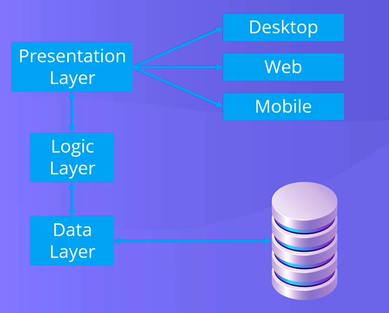

# 📘 Lecture: N-Tier Architecture & MVC (Advanced Programming)

---

## Course Context & Motivation

### Why This Lecture Matters

Modern software systems are no longer small or simple. Applications today are:

- Large-scale  
- Multi-user  
- Data-driven  
- Maintained by teams  

To manage this complexity, developers use software architecture patterns.

These patterns help in:

- Organizing code logically  
- Improving maintainability  
- Supporting scalability  
- Enabling teamwork  

---

### Real-World Connection

- Banking systems  
- Hospital management systems  
- E-commerce platforms  
- University portals  

These systems cannot be built using a single file or simple logic—they require structured architecture.

---

#  Understanding the Need for Architecture

## Problem Without Architecture

If we write all code in one place:

- UI + Logic + Database mixed together  
- Difficult to debug  
- Hard to maintain  
- Not reusable  

---

## Key Idea

> “Divide the system into parts where each part has a clear responsibility.”

This leads us to N-Tier Architecture.

---

#  N-Tier Architecture

## What is N-Tier Architecture?

N-Tier Architecture is a design approach where an application is divided into multiple layers (tiers), each responsible for a specific task.

---

## N-Tier Architecture Diagram

---

## Layers in N-Tier Architecture

### 1️⃣ Presentation Layer

This is the user interface of the application.

**Examples:**
- Desktop applications  
- Web applications  
- Mobile apps  

**Responsibilities:**
- Taking user input  
- Displaying output  

---

### 2️⃣ Business Logic Layer (BLL)

This layer contains the core logic of the application.

**Responsibilities:**
- Processing user input  
- Applying rules and validations  
- Making decisions  

---

### 3️⃣ Data Access Layer (DAL)

This layer interacts with the database.

**Responsibilities:**
- Storing data  
- Retrieving data  
- Executing queries  

---

## Data Flow in N-Tier

User → Presentation Layer → Logic Layer → Data Layer → Database  
Database → Data Layer → Logic Layer → Presentation Layer → User  

---

## Real-World Example

### Online Shopping System

- User places order (Presentation Layer)  
- System checks stock & calculates price (Logic Layer)  
- Data stored in database (Data Layer)  

---

## Advantages of N-Tier Architecture

- Clear separation of responsibilities  
- Easy maintenance  
- Scalable design  
- Secure data handling  
- Supports team development  

---

## Important Concept

Separation of Concerns = Each layer focuses on one responsibility only

---

# MVC Architecture (Model–View–Controller)

## What is MVC?

MVC is a design pattern used to organize applications, especially web applications, into three main components.

---

## MVC Diagram

---

## Components of MVC

### 1️⃣ Model

The Model represents data and business logic.

**Responsibilities:**
- Managing application data  
- Interacting with database  
- Applying rules  

---

### 2️⃣ View

The View represents the user interface.

**Responsibilities:**
- Displaying data  
- Showing output to users  

---

### 3️⃣ Controller

The Controller acts as a bridge between Model and View.

**Responsibilities:**
- Handling user input  
- Updating Model  
- Selecting View  

---

## Flow of MVC

User → View → Controller → Model  
Model → Controller → View → User  

---

## Real-World Example

### Login System

- User enters credentials (View)  
- Controller receives input  
- Model verifies data  
- Result displayed back in View  

---

## Key Concept

MVC separates UI, Logic, and Data handling within the UI layer

---

#  N-Tier vs MVC

| Feature | N-Tier Architecture | MVC |
|--------|--------------------|-----|
| Type | System architecture | Design pattern |
| Focus | Overall application structure | UI organization |
| Components | Multiple layers | Model, View, Controller |
| Usage | Enterprise systems | Web/UI applications |

---

## Important Relationship

MVC is often implemented inside the Presentation Layer of N-Tier Architecture

This means:

- N-Tier = Big structure  
- MVC = Internal UI structure  

---

#  N-Tier & MVC in .NET

## In Desktop Applications

- Presentation → Windows Forms / WPF  
- Logic → C# Classes  
- Data → Database Layer  

---

## In Web Applications (ASP.NET MVC)

- Model → C# classes  
- View → Razor pages (UI)  
- Controller → Handles requests  

---

## Practical Flow

Button Click → Controller → Logic Layer → Data Layer → Database  

---

#  Professional Analogy

## Hospital System

| Component | Mapping |
|----------|--------|
| Reception | View |
| Doctor | Controller |
| Patient Record | Model |
| Database | Data Layer |

---

# Summary of Lecture

- N-Tier Architecture divides system into layers  
- MVC organizes application into Model, View, Controller  

Both improve:

- Maintainability  
- Scalability  
- Code organization  

---

# 📌 What’s Next?

- Implementing N-Tier in C#  
- Building a simple MVC web application  
- Connecting UI with database  

---

### Reference

Text Book 3  

---

*End of Lecture*
