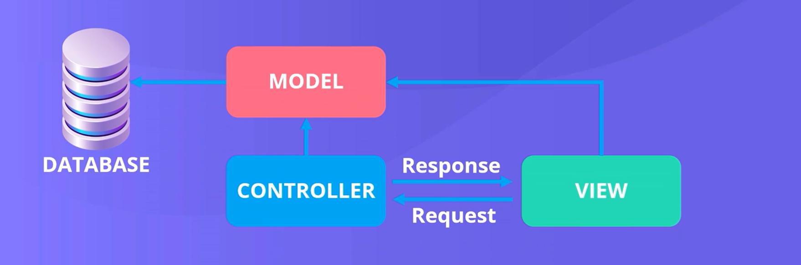

#  Lecture No 9: Introduction to ASP.NET MVC (Empty Project)

---

##  Lab Overview

In this lab, students will learn:

- What is ASP.NET MVC
- How to create an empty MVC project in Visual Studio
- How to add a Controller
- What is an Action Method
- How to run a basic MVC application
- Github Link 'https://github.com/Uzair390-Del/WebApplicationMVC-Week9'

---

##  Learning Objectives

By the end of this lab, students will be able to:

- Understand the basic concept of MVC architecture
- Create an empty ASP.NET MVC project
- Add a controller manually
- Write a simple ActionResult method
- Run and test the application in a browser

---

##  Basic Concept: What is MVC?

MVC stands for:

- **Model** → Handles data and business logic  
- **View** → Handles UI (what user sees)  
- **Controller** → Handles user input and controls flow 


 In simple words:

> Controller acts like a **middleman** between Model and View.
## MVC Diagram



---

##  Software Requirement

- Visual Studio (2019 / 2022)
- .NET SDK installed

---

##  Step 1: Create Empty MVC Project

Follow these steps:

1. Open **Visual Studio**
2. Click on **Create a new project**
3. Select **ASP.NET Web Application (.NET Framework)** OR **ASP.NET Core Web App**
4. Click **Next**
5. Enter:
   - Project Name: `MVC_Lab9`
6. Click **Create**

###  Important Step:

- Choose **Empty Template**
- ✔ Check **MVC (Model-View-Controller)** option

Click **Create**

---

##  Project Structure (Basic Understanding)

After creation, you will see:

- Controllers Folder
- Models Folder
- Views Folder

 Since this is an empty project, folders may be minimal.

---

##  Step 2: Add Controller

Now we will manually create a controller.

### Steps:

1. Right-click on **Controllers Folder**
2. Click **Add → Controller**
3. Select **MVC Controller - Empty**
4. Click **Add**
5. Name it:

Click **Add**

---

##  Step 3: Write Action Method

Inside `HomeController.cs`, write the following code:

```csharp
using System.Web.Mvc;

public class HomeController : Controller
{
    public ActionResult Index()
    {
        return Content("Welcome to ASP.NET MVC Application!");
    }
}
```
---

###  Understanding the Code
- Controller → Base class for all controllers
- ActionResult → Return type of action method
- Index() → Default method
- Content() → Returns simple text response

-  This means when we open the page, it will display text in browser.

---


##  Introduction

In ASP.NET MVC, **controllers play a very important role**.

- All the application logic and data handling is mainly done inside **controller classes**.

Inside controllers, we write special methods called:

> **Action Methods (ActionResult methods)**

---

##  What is an ActionResult?

An **ActionResult** is a return type of a controller method.

- In simple words:

> An ActionResult is used to **process user request and return a response**.

---

##  Key Idea

- All **operations (logic, data handling, processing)** happen inside action methods
- After processing, the result is sent to:
  - A **View (UI page)** OR
  - Another **Action** OR
  - A **different website**

---

##  Flow of Action Method

User Request → Controller → Action Method → Processing → Response (View / Redirect / Data)

- This shows that the **controller manages all the information flow**.

---

##  Basic Example

```csharp
public ActionResult Index()
{
    return View();
}
```
---

##  Explanation:
- ActionResult → Return type
- Index() → Action method
- View() → Sends response to a View page

This means:

After processing, the system will open a View page to display result.
---

## What Can We Do Inside Action Methods?

Inside an action method, we can:

- Send data to the View
- Receive data from the View
- Perform database operations
- Apply business logic
- Redirect to another action or website

- So, action methods are the main working area of MVC applications.

- Different Types of Action Results
- Returning a View
### return View();
---

- Used when:

You want to display a UI page
 -  Returning Content
return Content("Hello Students!");
---

 Used when:

You want to display simple text in browser
 -  Redirect to External URL
return Redirect("https://example.com");
---

 Used when:


You want to open another website
- Redirect to Another Action
return RedirectToAction("Index");
---

 Used when:

You want to move to another action in same controller
- Redirect to Action in Another Controller
return RedirectToAction("AddProduct", "Product");
---

- Important Rule:

First parameter → Action Name
Second parameter → Controller Name (without "Controller")
- Important Concept: Multiple Controllers

---

### In real-world applications:

We have multiple controllers
Each controller has multiple action methods

- Example:

1. HomeController
2. ProductController
3. StudentController

- Each controller handles different parts of the application.

-Example: Redirect Between Actions

public ActionResult GoToProduct()
{
    return RedirectToAction("AddProduct", "Product");
}

 This means:

Go to AddProduct action
Inside ProductController
 Passing Parameters in Action Methods

We can also pass data (parameters) to action methods.

Example:
```csharp
public ActionResult UpdateProduct(int id)
{
    return Content("Product ID: " + id);
}
```
-  Redirect with Parameters
```csharp
return RedirectToAction("UpdateProduct", "Product", new { id = 20 });
```

 Output:

Product ID: 20
 Behind the Scene (Routing Concept)
MVC uses a routing system to map URLs to actions
Example URL:
/Product/UpdateProduct/20

 This means:

Controller → Product
Action → UpdateProduct
Parameter → 20
- Important Notes
Controller name is written without "Controller" in URLs and redirects
Action methods must be public
Action methods usually return ActionResult
🧪 Mini Practice
Task:
Create a controller named ProductController
Add the following actions:
```csharp
public ActionResult Index()
{
    return Content("Product Home");
}

public ActionResult AddProduct()
{
    return Content("Add Product Page");
}

public ActionResult GoToAddProduct()
{
    return RedirectToAction("AddProduct");
}
```
###  Summary
Action methods are the core of MVC logic
They handle:
- Data
- Processing
- Navigation
They return results using ActionResult

** In short **:

- Controller = Brain of MVC
- Action Methods = Working units inside the brain


#  Views in ASP.NET MVC

---

##  Introduction

In ASP.NET MVC, after learning about **Controllers and Action Methods**, the next important component is:

> **View (User Interface Layer)**

Views are responsible for **what the user sees on the screen**.

---

## What is a View?

A **View** is the part of MVC that handles the **User Interface (UI)**.

 In simple words:

> A View is used to **display data to the user**.

---

##  Key Idea

- Views contain **UI elements** such as:
  - Textboxes  
  - Checkboxes  
  - Dropdowns  
  - Buttons  

- Views are mainly built using:
  - HTML  
  - CSS  
  - JavaScript  

 Users can only see the **View**, not the controller or model.

---

##  Where Are Views Stored?

- All views are stored inside the **Views Folder**

 Important concept:

> Each **Controller has its own View folder**

### Example Structure:
#  Views in ASP.NET MVC (Complete Notes)

---

##  Views Folder Structure

```
Views/
├── Home/
├── Product/
├── Student/
```

 This means:
- `HomeController` → Views in **Home folder**
- `ProductController` → Views in **Product folder**

---

##  View File Extension

Views in MVC usually have extension:

```
.cshtml
```

 This means:
- Combination of **C# + HTML**

---

##  Relation Between Controller and View

Rule:

> Each **Action Method should have a View** (in most cases)

### Example:

```csharp
public ActionResult Index()
{
    return View();
}
```

 This means:

MVC will look for a view named **Index.cshtml**

---

##  Step-by-Step: Creating a View

### Step 1: Open Controller
Go to your controller (e.g., HomeController)

### Step 2: Add View
- Right-click on Action Method (e.g., Index)
- Click **Add → View**

### Step 3: Configure View
- View Name → Keep same as Action (recommended)
- Layout → Select or leave empty (for now)

 Layout is like a **master page (common design)**

### Step 4: Click Add

 A new `.cshtml` file will be created automatically

---

##  Understanding View Content

Inside a View, we write:

- HTML → Structure  
- CSS → Styling  
- JavaScript → Interaction  

### Example:

```html
<h1>Welcome to MVC Application</h1>
```

---

##  Running the Application with View

 Important:

MVC application usually runs using **View Pages**

### Example URL:

```
/Home/Index
```

 This will:

- Call `Index()` action  
- Return `Index.cshtml` view  

---

##  Views with Redirects

From previous lecture:

```csharp
return RedirectToAction("AddProduct", "Product");
```

 Important concept:

> If you redirect to an action, that action must also have a View

---

##  Example: View with Redirect

### Step 1: Controller Code

```csharp
public ActionResult GoToProduct()
{
    return RedirectToAction("AddProduct", "Product");
}
```

### Step 2: Required Views

You must create:

- `GoToProduct.cshtml` (optional but safe)  
- `AddProduct.cshtml` (required)

 Otherwise, error will occur

---

##  Views with Parameters

### Example:

```csharp
public ActionResult UpdateProduct(int id)
{
    return View();
}
```

### URL Example:

```
/Product/UpdateProduct/20
```

 This means:

- View will open with **id = 20**

---

##  Behind the Scene (Routing + Views)

Routing connects:

```
URL → Controller → Action → View
```

 Flow:

```
User → Controller → Action → View → Browser Output
```

---

##  Technologies Used in Views

In View pages, we use:

- HTML → Structure  
- CSS → Design  
- JavaScript → Dynamic behavior  

 This makes UI:

- Interactive  
- User-friendly  
- Responsive  

---

##  Important Notes

- Each action should have a corresponding view (recommended)  
- View name should match action name  
- Views are stored inside controller-based folders  
- Missing view → Runtime error  

---

##  Mini Practice

### Task:

1. Create `ProductController`

2. Add actions:

```csharp
public ActionResult Index()
{
    return View();
}

public ActionResult AddProduct()
{
    return View();
}
```

### Step 3: Create Views

Create:

- `Views/Product/Index.cshtml`
- `Views/Product/AddProduct.cshtml`

### Step 4: Add Simple HTML

```html
<h2>Product Page</h2>
```

---

##  Summary

- View is responsible for **UI (User Interface)**  
- It displays data to the user  
- Uses HTML, CSS, JavaScript  
- Connected with Controller via Action Methods  

 In short:

- **View = What User Sees**  
- **Controller = What System Does**

---

##  What’s Next?

In next lecture:

- Layouts (Master Page concept)  
- Shared UI structure  
- Reusable design  

---

#  Lecture: Layouts in ASP.NET MVC

---

##  Introduction

In ASP.NET MVC, when building real applications, many UI parts are **common across multiple pages**.

 Examples:
- Header (Logo)
- Navigation Bar
- Footer

Instead of repeating this code again and again, MVC provides:

> **Layouts**

---

##  What is a Layout?

A **Layout** is a special view that contains **common UI structure** shared across multiple pages.

 In simple words:

> Layout = **Master Page (common design for all pages)**

---

##  Key Idea

- Layout contains common UI parts:
  - Header  
  - Footer  
  - Navigation  

- It avoids:
  - Code repetition  
  - Duplicate UI design  

 So, we write UI once and reuse it everywhere.

---

##  Where is Layout Stored?

Layouts are usually stored in:

```
Views/Shared/
```

 Example:

```
Views/
 ├── Shared/
 │    ├── _Layout.cshtml
```

---

##  Important Concept: RenderBody()

In Layout file, we use:

```csharp
@RenderBody()
```

 Meaning:

> This is the place where **View content will be inserted**

---

##  Flow of Layout Usage

```
View → Layout → RenderBody() → Final Page Output
```

 Layout wraps the View content.

---

##  Step-by-Step: Creating a Layout

### Step 1: Go to Shared Folder

- Open `Views/Shared`

---

### Step 2: Add New Layout

1. Right-click → Add → New Item  
2. Select **Layout Page**  
3. Name it:

```
EmployeeLayout.cshtml
```

---

### Step 3: Add Basic UI

Example:

```html
<h1>Layout Header</h1>

@RenderBody()

<h3>Layout Footer</h3>
```

 This creates a basic layout structure.

---

##  Creating Controller for Layout Demo

### Step 1: Create Controller

```csharp
public class EmployeeController : Controller
{
    public ActionResult Index()
    {
        return View();
    }

    public ActionResult AddEmployee()
    {
        return View();
    }

    public ActionResult UpdateEmployee()
    {
        return View();
    }
}
```

---

##  Adding Views with Layout

### Step 1: Add View

- Right-click on `Index()` → Add View  

---

### Step 2: Select Layout

- Choose:
  - `EmployeeLayout.cshtml`

---

### Step 3: Click Add

 View is now connected with Layout.

---

## ▶ Output Behavior

When you run:

 You will see:

- Header (from Layout)  
- Footer (from Layout)  
- Content (from View)  

---

##  Multiple Views with Same Layout

Create views for:

- `AddEmployee`
- `UpdateEmployee`

 All will use same layout

---

##  Key Observation

- Header and Footer → SAME  
- Content → DIFFERENT  

 Only **View content changes**, layout remains same.

---

##  Why Layout is Important?

- Reusable UI  
- Cleaner code  
- Easy maintenance  
- Professional structure  

---

##  Important Notes

- Layout is optional but highly recommended  
- Stored in `Shared` folder  
- Uses `@RenderBody()` to inject content  
- Multiple views can share one layout  

---

##  Mini Practice

### Task:

1. Create `EmployeeController`  
2. Add actions:
   - Index  
   - AddEmployee  
   - UpdateEmployee  

3. Create Layout:
   - Add header and footer  

4. Link layout with all views  

---

##  Summary

- Layout is a **common UI template**  
- Avoids code duplication  
- Uses `@RenderBody()` to inject view content  

 In short:

- **Layout = Common Design**  
- **View = Page Content**

---

##  What’s Next?

In next lecture:

- Partial Views  
- Reusable UI components inside pages  

---
##  Introduction

In the previous lecture, we learned about **Layouts**, which are used for common UI across all pages.

 But sometimes, we need reusable UI only for **some specific pages**, not all.

For this purpose, MVC provides:

> **Partial Views**

---

##  What is a Partial View?

A **Partial View** is a reusable UI component that can be used in multiple views.

 In simple words:

> Partial View = **Reusable small UI block**

---

##  Key Idea

- Used for **common UI in some pages (not all)**
- Avoids repeating same code
- Improves:
  - Code reusability  
  - Maintainability  
  - Development speed  

---

##  Real-World Example

Suppose you have:

- Add Employee Page  
- Update Employee Page  

 Both need:
- Name  
- Salary  

But another page (e.g., Category Page) does NOT need salary.

- So instead of repeating code:

> We create a **Partial View** for Employee Form

---

##  Where to Create Partial Views?

Usually inside controller-specific folder:

```
Views/
├── Employee/
│   ├── Partial/
```

---

##  Step-by-Step: Creating a Partial View

### Step 1: Create Folder

- Go to `Views/Employee`
- Create new folder:

```
Partial
```

---

### Step 2: Add Partial View

1. Right-click on `Partial` folder  
2. Click **Add → View**  
3. ✔ Check **"Partial View" option**  
4. Name it:

```
_EmployeeForm.cshtml
```

---

##  Writing Partial View Code

Example:

```html
<label>Name</label>
<input type="text" />

<label>Salary</label>
<input type="text" />

<button type="submit">Submit</button>
```

 This is a reusable form UI

---

##  Using Partial View in Main View

To use partial in a view:

```csharp
@Html.Partial("~/Views/Employee/Partial/_EmployeeForm.cshtml")
```

 This will render the partial inside your page.

---

##  Using Partial in Multiple Views

### In AddEmployee.cshtml

```csharp
@Html.Partial("~/Views/Employee/Partial/_EmployeeForm.cshtml")
```

### In UpdateEmployee.cshtml

```csharp
@Html.Partial("~/Views/Employee/Partial/_EmployeeForm.cshtml")
```

---

##  Output Behavior

 Both pages will show:

- Name textbox  
- Salary textbox  
- Submit button  

 But:

- Index page → No partial (if not added)

---

##  Key Observation

- Partial is only used where needed  
- Not applied globally like Layout  

---

##  When to Use Partial Views?

Use Partial Views when:

- Same UI is used in multiple pages  
- Forms are repeated  
- Small UI components are reused  

 Examples:

- Forms  
- Message sections  
- Reusable UI blocks  

---

##  Important Notes

- Partial Views are optional  
- Used for specific reuse, not global UI  
- Improve performance and code readability  
- Avoid duplication in large projects  

---

##  Mini Practice

**Task:**

- Create EmployeeController  
- Add actions:
  - AddEmployee  
  - UpdateEmployee  

- Create Partial View:
  - _EmployeeForm.cshtml  

- Add form fields:
  - Name  
  - Salary  

- Use partial in both views  

---

##  Summary

- Partial View = Reusable UI component  
- Used in multiple views  
- Avoids code repetition  
- Improves maintainability  

 In short:

- Layout = Common for ALL pages  
- Partial = Common for SOME pages  

---

##  What’s Next?

In next Topic:

- Model in MVC  
- Data handling and business logic

## Objective

By the end of this lab, students will be able to: - Understand the role
of the Model in MVC architecture - Create a model class - Pass data from
the controller to the view using models - Display model data in a view -
Work with both single objects and collections (lists) of models

## Prerequisites

Before starting this lab, students should be familiar with: - MVC
Architecture (Model, View, Controller) - Basic C# class structure -
Controllers and Views in MVC

## Introduction to Model in MVC

The Model is a core component of the MVC architecture.

### Definition

A Model: - Represents domain-specific data and business logic -
Maintains application data - Interacts with the database or persistence
layer - Acts as an encapsulated class for storing and transferring data

### MVC Flow Recap

-   Controller creates and fills the model
-   Model holds the data
-   View displays the data to the user

## Lab Task 1: Create a Model Class

### Step 1: Add Model Class

-   Right-click on the Models folder
-   Select Add → Class
-   Name the class: Employee

### Step 2: Define Properties

Create properties inside the Employee class: - Id - Name - Salary

- These properties will store the data entered or retrieved.

## Lab Task 2: Use Model in Controller

### Step 1: Create Model Object

Inside your controller: - Create an instance of Employee - Assign
values: - Id = 1 - Name = "Charles" - Salary = 5000

### Step 2: Send Model to View

``` csharp
return View(employee);
```

## Lab Task 3: Create and Use View

### Step 1: Create View

-   Right-click inside the controller action
-   Select Add View
-   Choose Empty Template

### Step 2: Define Model in View

``` csharp
@model ProjectName.Models.Employee
```

## Lab Task 4: Display Data in View

### Step 1: Create HTML Table

Add a table with: - Header row (Id, Name, Salary) - Data row using model
values

### Step 2: Access Model Data

``` csharp
@Model.Id
@Model.Name
@Model.Salary
```

## Output

A table displaying: - Employee Id - Employee Name - Employee Salary

## Lab Task 5: Working with Multiple Records

### Problem

A single object only shows one row. Real applications require multiple
records.

### Step 1: Create List of Employees

In controller: - Create a list of Employee - Add multiple objects: -
Employee 1 → Charles (5000) - Employee 2 → Bernard (4000)

### Step 2: Send List to View

``` csharp
return View(employeeList);
```

### Step 3: Update View Model Type

``` csharp
@model List<ProjectName.Models.Employee>
```

## Lab Task 6: Display List Using Loop

### Why Loop?

Because the model is now a collection, not a single object.

### Step 1: Use foreach Loop

``` csharp
@foreach (var item in Model)
{
    <tr>
        <td>@item.Id</td>
        <td>@item.Name</td>
        <td>@item.Salary</td>
    </tr>
}
```

## Final Output

A table displaying multiple employees dynamically.

## Key Concepts Learned

-   Model represents data + business logic
-   Controllers populate models
-   Views render model data
-   Use List`<T>`{=html} for multiple records
-   Use foreach loop to display collections

## Conclusion

In this lab, you learned how to: - Create and use models in MVC - Pass
data from controller to view - Display both single and multiple records

## Next Lab Preview

In the next session, you will learn: - Handling HTTP GET - Handling HTTP
POST in MVC
